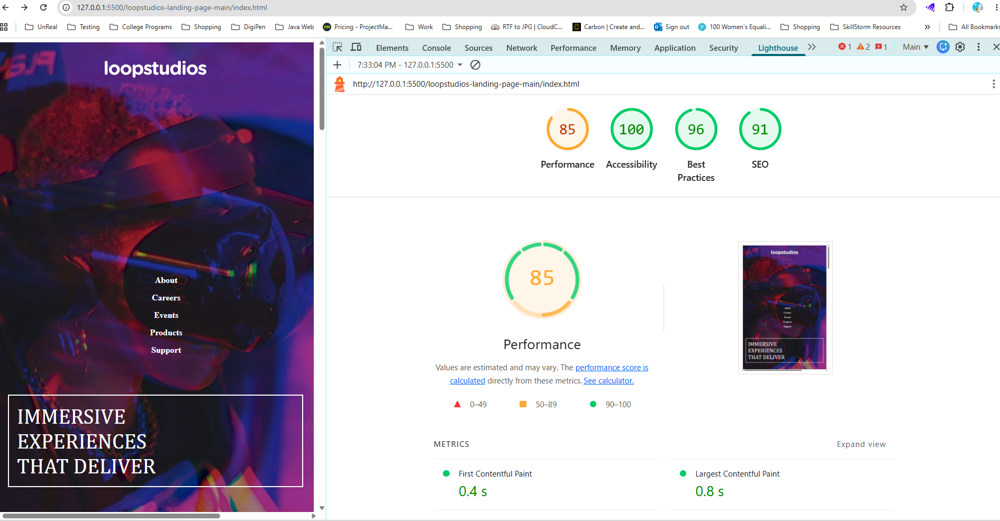

## Reflections

### What accessibility challenges did you face, and how did you address them?

making it responsive and and since there was no interactivity on this page, i couldnt really demonstrate a whole lot of accessibility other than listed below.

### How did you ensure that your design was responsive and accessible to all users?

I struggled with making this site responsive, but I got it working partially. I made it accessible to all users by making use of aria-role=navigation for the navigation part. I used alt attribute to describe the images.

### What tools or resources did you find most helpful during this project?

I used lighthouse for checking the performance, accessiblity and overall user experience. Below is the screenshot.

